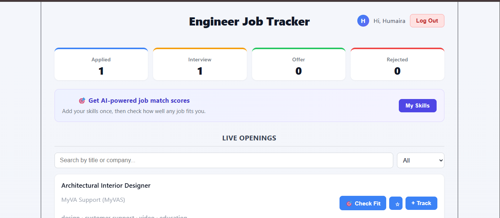
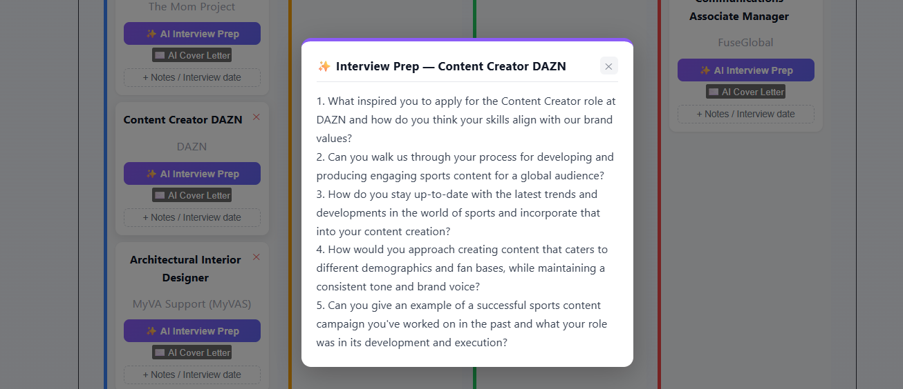
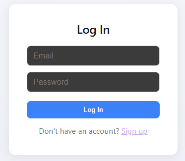

# 🎯 Engineer Job Tracker

A full-stack MERN application that helps engineering students and job seekers discover live job openings and track their applications through every stage — with AI-powered interview prep, cover letters, and job fit scoring.

**🔗 Live Demo:** https://engineer-job-tracker.vercel.app

## ✨ Features

- 🔍 Live engineering job listings (Software, DevOps, Data, Mechanical, Electrical, Civil)
- 🗂️ Drag-and-drop Kanban board (Applied → Interview → Offer → Rejected)
- 🔐 Secure authentication (JWT + bcrypt password hashing)
- ⭐ Save jobs for later before committing to track them
- 📝 Notes and interview date tracking per application
- ✨ AI-generated interview prep questions (Groq/Llama 3.3)
- ✉️ AI-generated cover letter openers
- 🎯 AI job fit scoring based on your skills
- 📱 Fully responsive design
- 💼 Custom favicon and branded page title

## 🛠️ Tools & Technology Used

### Frontend
| Tool | Purpose |
|---|---|
| **React (Vite)** | Component-based UI with fast builds and instant hot-reload |
| **React Router** | Client-side routing and protected pages (Login/Signup/Dashboard) |
| **Axios** | Simplified HTTP requests to the backend API |
| **CSS (custom)** | Full control over styling without a framework |

### Backend
| Tool | Purpose |
|---|---|
| **Node.js** | JavaScript runtime for the server, same language as the frontend |
| **Express.js** | Lightweight framework for building REST API routes |
| **CORS** | Allows the deployed frontend to securely communicate with the backend |
| **dotenv** | Keeps secrets (DB credentials, API keys) out of the codebase |

### Database
| Tool | Purpose |
|---|---|
| **MongoDB Atlas** | Cloud-hosted NoSQL database for persistent storage |
| **Mongoose** | Schema modeling and clean, structured database queries |

### Authentication & Security
| Tool | Purpose |
|---|---|
| **bcryptjs** | Hashes user passwords before storing them |
| **jsonwebtoken (JWT)** | Issues secure tokens to keep users logged in and protect private routes |

### AI Integration
| Tool | Purpose |
|---|---|
| **Groq API (Llama 3.3)** | Powers AI interview prep questions, cover letter generation, and job fit scoring |

### Third-Party Data
| Tool | Purpose |
|---|---|
| **RemoteOK API** | Supplies live, real-world engineering job listings |

### Deployment
| Tool | Purpose |
|---|---|
| **Render** | Hosts the Node/Express backend |
| **Vercel** | Hosts the React frontend with automatic deployments from GitHub |

### Dev Tools
| Tool | Purpose |
|---|---|
| **VS Code** | Code editor with integrated terminal |
| **nodemon** | Auto-restarts the backend server on file changes during development |
| **npm** | Installs and manages all project dependencies |
| **Git & GitHub** | Version control and source code hosting |

## 🚀 Getting Started Locally

### Prerequisites
- Node.js installed
- MongoDB Atlas account (free tier)
- Groq API key (free)

### Backend Setup
\`\`\`bash
cd backend
npm install
# create a .env file with MONGO_URI, JWT_SECRET, GROQ_API_KEY, PORT
npm run dev
\`\`\`

### Frontend Setup
\`\`\`bash
cd frontend
npm install
# create a .env file with VITE_API_URL=http://localhost:5000
npm run dev
\`\`\`

## 📸 Screenshots
## 📸 Screenshots

### Kanban Dashboard

### AI Interview Prep

### Login Page

## 👩‍💻 Author

Built by **Humaira Naaz**